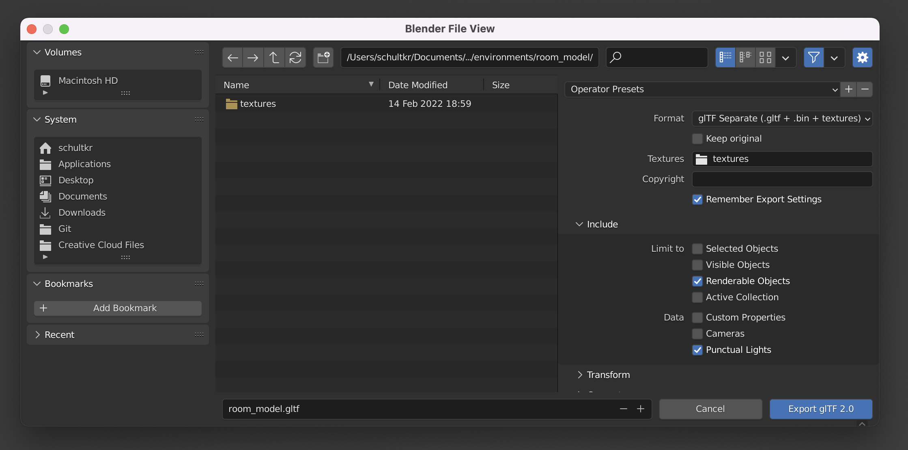

# BabylonJS, Amazon Lex, and Sumerian Host Sample

This sample BabylonJS application demonstrates how to combine the open source Sumerian Host characters with Amazon Lex.

## Prerequisites

- Have [NodeJS](https://nodejs.org/en/) installed
- *Recommended:* [Visual Studio Code](https://code.visualstudio.com/) or similar JavaScript-friendly editor

## Developer Quick Start

### Local Setup

Clone this repository (or download the contents as a ZIP file.)

In a command terminal, navigate to the root of the downloaded repository:

```
cd sumerian-host-lex-babylon-sample
```

Install dependencies:

```
npm install
```

Fix any installation audit issues:

```
npm audit fix
```

### AWS Infrastructure Setup

In order for the demo to be runnable you will need to set up a few things in your AWS account. You'll setup the actual **Amazon Lex chatbot** that powers this demo. You will then deploy the app using **AWS Amplify**.

#### Lex Bot Setup

From the AWS console, navigate to the Amazon Lex service.

Confirm that the Lex console is set to your desired AWS region. This must be the same region you chose when creating your Cognito Identity Pool.

If presented with a **"Get Started"** button, click it.

> ⚠️ By default you will be taken to the Lex V2 console. However, the bot used in this demo is only compatible with Lex V1. In the left-hand navigation, select "Return to the V1 console" before proceeding.

From the Bots tab, select **Actions > Import**.

Give the bot a name. We'll use the name *"Demo_SumHostSeating"* for these instructions.

Import the "<repository-root>/amazon-lex/Demo_SumHostSeating_Bot_LEX_V1.zip" file from your local computer.

After the bot definition has been imported you should see the bot listed in the console. Click the bot name to access the bot.

Click the **"Build"** button in the upper right-hand corner.

A message window will appear. Dismiss this window by clicking its **"Build"** button.

After the build completes click the **"Publish"** button.

When prompted, give the bot a meaningful alias. We'll use the alias *"Dev"* for these instructions. 

Click the **"Publish"** button to complete the publishing process.

Once publishing is complete, ✏️ write down the "Bot Name" and "Alias" values so you can easily refer to them later. You may dismiss the notification window after doing this.

🎉 Your Lex bot setup is now complete! 

#### Initialize the project as an Amplify app

> ⚠️ **Important:** Before you begin, be sure your Amplify CLI installation is updated to at least 7.6.24 by running `npm i -g @aws-amplify/cli`.

1: Open a terminal and `cd` to the root of this project.

2: Start the process of configuring the project as an Amplify app by running:

```
amplify init
```

3: Use the following responses for the next few prompts:

| prompt                                               | response                                                     |
| ---------------------------------------------------- | ------------------------------------------------------------ |
| Enter a name for the project                         | Enter a name or use the default                              |
| Initialize the project with the above configuration? | "Y"                                                          |
| Select the authentication method you want to use     | "AWS profile" (Recommended for this tutorial, but feel free to choose another method if you're knowledgeable.) |

4: At this point you'll see one of the following two prompts:

- *Prompt A:* **"Please choose the profile you want to use"**
  - If you see this prompt, continue to step 5.
- *Prompt B:* **"Setup new user?"**
  - If you see this prompt follow the steps below...
  - Enter "Y" in response to the prompt.
  - Follow the prompts to sign into the AWS console.
  - Select your preferred AWS region.
  - Enter a new user name for the IAM user that will be created (or accept the auto-generated username).
  - A browser window will open to the IAM "Add user" page. Leave the default settings as-is and click "Next: Permissions".
  - The proper permissions allowing Amplify administrator access are already preselected. Click "Next: Tags".
  - Add a tag if you would like (optional), then click "Next: Review".
  - Click "Create User" to complete the IAM user creation process.
  - **IMPORTANT:** Download the .csv file for safe keeping.
  - Keep the browser window open, but return to the terminal and hit enter to continue in the terminal.
  - When prompted for the "accessKeyId" and "secretAccessKey" values in the terminal, use the values shown in the browser. (These values can als be found in the .csv file you downloaded above.)
  - When prompted, enter a new profile name to be used locally (or accept the default of "default"). 

5: When prompted to choose a profile for Amplify to use, select any profile that has been assigned permissions equivalent to those found in the "AdministratorAccess-Amplify" managed permissions policy in the IAM console. If you followed the "Setup new user" steps above, the user profile you created already has the appropriate permissions. If you're using a pre-existing user profile, you can confirm and/or change it's permissions in the IAM console.

#### Add Amplify hosting

Now that the foundational Amplify app configuration is complete, we can some required capabilites to our Amplify app, including hosting.

6: Run:

```
amplify add hosting
```

7:  Use the following responses for the next few prompts...

| prompt                              | response                                                     |
| ----------------------------------- | ------------------------------------------------------------ |
| Select the plugin module to execute | "Hosting with Amplify Console" (Recommended for this tutorial, but feel free to choose another method if you'd like.) |
| Choose a type                       | "Manual deployment"                                          |

#### Add Amplify auth capabilities

This sample app needs to be able to call the Amazon Polly and Amazon Lex services. The following steps will enable our app to make calls to those services.

8: Run:

```
amplify add auth
```

9: Use the following responses for the next few prompts...

| prompt                                                       | response                                                     |
| ------------------------------------------------------------ | ------------------------------------------------------------ |
| Do you want to use the default authentication and security configuration? | "Manual configuration"                                       |
| Select the authentication/authorization services that you want to use: | "User Sign-Up, Sign-In, connected with AWS IAM controls"     |
| Provide a friendly name for your resource that will be used to label this category in the project | "AwsApiAccess" (or a name of your choosing)                  |
| Enter a name for your identity pool                          | "SumerianHostSample_IdentityPool" (or a name of your choosing) |
| Allow unauthenticated logins?                                | "Yes" - By allowing unauthenticated logins, even anonymous visitors will be able to use this app |
| Do you want to enable 3rd party authentication providers in your identity pool? | "No"                                                         |
| Provide a name for your user pool                            | "SumerianHostSample_UserPool" (or a name of your choosing)   |
| How do you want users to be able to sign in?                 | Choose any value. We won't actually be prompting users to create accounts, so this option is irrelevant to our app. |
| Do you want to add User Pool Groups?                         | "No" (This option is irrelevant to our app.)                 |
| Do you want to add an admin queries API?                     | "No"                                                         |
| Multifactor authentication (MFA) user login options          | "OFF" (This option is irrelevant to our app.)                |
| Email based user registration/forgot password                | "Enabled" (This option is irrelevant to our app.)            |
| Specify an email verification subject                        | Use the default. (This option is irrelevant to our app.)     |
| Specify an email verification message                        | Use the default. (This option is irrelevant to our app.)     |
| Do you want to override the default password policy for this User Pool? | "N" (This option is irrelevant to our app.)                  |
| What attributes are required for signup?                     | Hit Enter to accept the defaults. (This option is irrelevant to our app.) |
| Specify the app's refresh token expiration period (in days)  | Use the default.                                             |
| Do you want to specify the user attributes this app can read and write? | "N"                                                          |
| Do you want to enable any of the following capabilities?     | Hit Enter to skip this step.                                 |
| Do you want to use an OAuth flow?                            | "No"                                                         |
| Do you want to configure Lambda Triggers for Cognito?        | "N"                                                          |

#### Deploy the Amplify app back-end

Now that we've configured "hosting" and "auth" capabilities it's time to deploy the related back-end services. 

10: Run:

```
amplify push
```

11: You will be presented with a summary of the changes about to take place along with the confirmation prompt, **"Are you sure you want to continue?"**. Respond with "Y".

After a few minutes you should be presented with confirmation saying, "All resources are updated in the cloud".

#### Add Amazon Polly and Amazon Lex permissions

As a result of adding "auth" support to our app above, your AWS account now contains a new IAM role which will be used by our app. But right now that IAM role doesn't have permissions to access any AWS services. Let's fix that.

12: In a browser, log into the AWS console and navigate to the IAM console.

13: Click on the "Roles" link in the left nav.

14: Search for the role named with a pattern similar to the following: `amplify-{name you gave the app}-dev-{some numbers}-unauthRole` Click on the role name, making sure the name ends with "unauthRole".

15: Click the "Add permissions" button and choose "Attach policies".

16: Add the following two policies to the role. (You can use the search field to search for the policies):

- "AmazonPollyReadOnlyAccess"
- "AmazonLexRunBotsOnly"

 🎉 Your AWS infrastructure setup is now complete!

### Test the app locally

Now that we're finished with the Amplify app configuration and setup, let's test the app locally to make sure everything is working.

17: Switch back to the terminal. (If you closed the terminal, open a new one and navigate to the project root.)

18: Run the following:

```
npm start
```

This will start a local webserver and launch a browser to display the app. You should see a loading screen for a few seconds and then a "Welcome" message and a "Begin" button should appear. If you see this then, congratulations! Everything was set up properly. 

> **Note:** If the app doesn't load, open the browser JavaScript console to see if there are error messages that might give you a clue as to what might have gone wrong, then retrace your steps through the instructions above.

20: Now that you've confirmed the app front-end works, you can quit the webserver by pressing Ctrl-C in the terminal.

### Deploy the Amplify app front-end

Once you've confirmed that the app front-end is working locally, you're ready to deploy it to the cloud. 

19: Run:

```
amplify publish
```

20: After the front-end has finished deploying, the terminal will display the public URL for your app. Copy-paste that URL into a browser to view the app.

🎉 Congratulations! You've successfully launched the sample app using Amplify.

### Making code changes

If you make changes to the app's source code, you can test those changes locally using the same `npm start` command you used above. When you're ready to deploy your changes, just run the `amplify publish` command again. It's that easy!

## Demo Notes

Microphone recording is not implemented in this demo. Instead, there are some "magic" keyboard keys you can use to simulate various spoken input values. To trigger these simulated speech inputs, press and release the "push-to-talk" button on screen while holding down one of the following keys:

- **1** key = *"Where is my desk"*
- **2** key = *"ABC1234"*
- **3** key = *"ABE1234"*
- **4** key = "00012357"
- **Y** key = *"yes"*
- **N** key = "no"
- If no key is pressed a value of "sssss" will be sent to Lex, representing unintelligble audio

## Project Details for Developers

Below is a description of the top-level folders.

```
📁 amazon-lex       👈 Contains Lex bot definition
📁 art-source       👈 Contains source files for 2D and 3D art assets used in the app
📁 front-end-app    👈 Source code for the main application
```

#### Finding important dev tasks

To quickly see which values you may need to update and which areas require you to add your own implementation, do a project-wide search for *"TODO:"*. This will bring up a list of TODO comments highlighting important areas that may need your attention.

#### Changing the host character

If you'd like to change which host character is used, open the **"/front-end-app/scripts/app/main.js"** file and edit the `characterId` value (line 39.)

#### Changing the host voice

If you'd like to change the voice used by the host, open the **"<repo>/front-end-app/scripts/app/main.js"** file and edit the `pollyVoice` value (line 28) and, optionally, the `pollyEngine` value (line 34.)

#### Customizing host clothing

Host character clothing can be customized by editing certain texture (image) files. As an example, this project includes a modified version of the shirt texture used by the "Cristine" character. The texture has been modified to include a company logo. The modified texture is located at:

 ```
 /front-end-app/3d-assets/characters/adult_female/cristine/textures/shirt_diff.jpg
 ```

Other character textures share a similar file organization pattern.

#### Customizing the 3D environment

A simple 3D room model has been created for this demo. The source Blender file for this 3D asset is found at:

````
/art-source/3d/environments/room_model/room_model.blend
````

If you'd like to modify this 3D asset, open it in [Blender](https://www.blender.org/) (free open source 3D application), make your edits, and then export it as a glTF for use by the application following this process...

From Blender, **File > Export > glTF 2.0**.

In the window that appears, within the right hand panel enable the settings as show below:



Set the export destination to:

````
<repo>/front-end-app/3d-assets/environments/room_model/room_model.gltf
````

Click the **Export glTF 2.0** button.

The next time you run the application your updated 3D room model will be used.

#### Script file overview

The following application scripts are found under **/front-end-app/scripts/app/**...

📄 **main.js** 

This is the main entry point of the application.

📄 **scene-room.js** 

The script handles loading and setup of the visual 3D environment of your scene. It also creates the camera used by the application.

📄 **conversation-controller.js** 

This script manages the flow of the chatbot conversation. If you want to change how the app handles user input or how it responds to chatbot responses, do that here.

📄 **lex-bot.js** 

This script provides a simple API for interacting with any Lex bot.

📄 **iframe-capture.js** and 📄 **virtual-screen.js**

These scripts work together to enable regular web pages to be displayed on the virtual screen in the 3D environment. The "iframe-capture.js" script should be included in any web page that you want to be able to display on the virtual screen. See the following web pages as examples of how to use the "iframe-capture.js" script – 📄 **/front-end-app/content-screen-start.html** and 📄 **/front-end-app/content-screen-seating.html**


